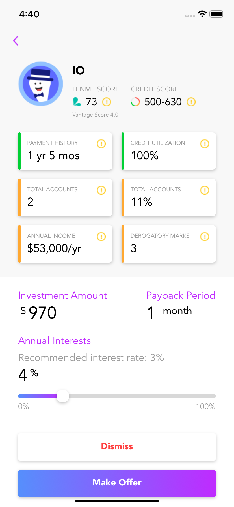

To setup this application on your system first run the following command:
`yarn`.

To run this application on iOS device use `react-native run-ios` and for android use `react-native run-android`.

## Lenme: Loan request details page

    

